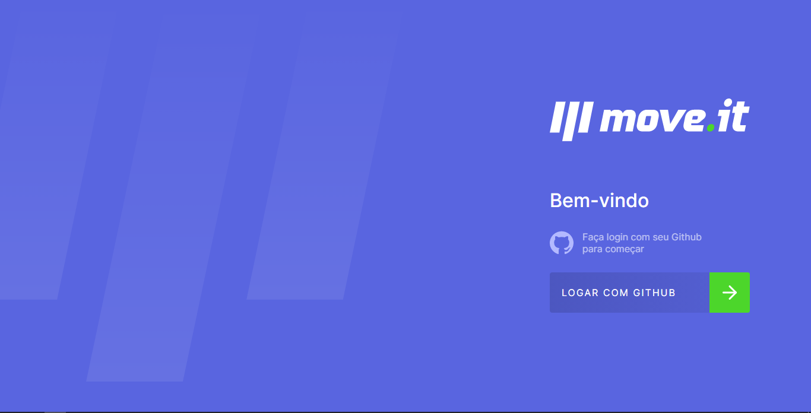
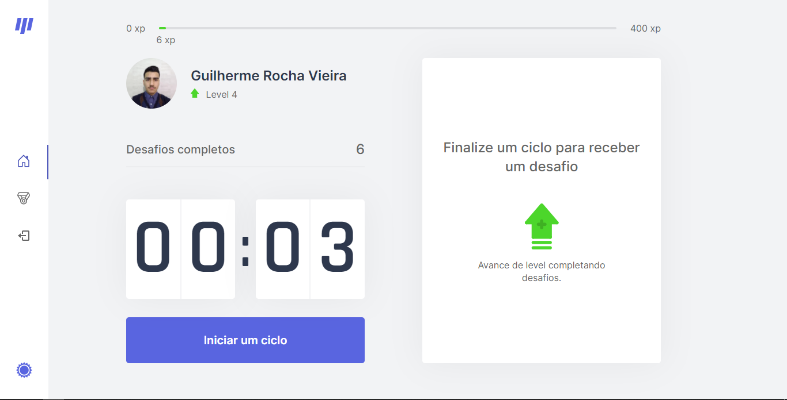
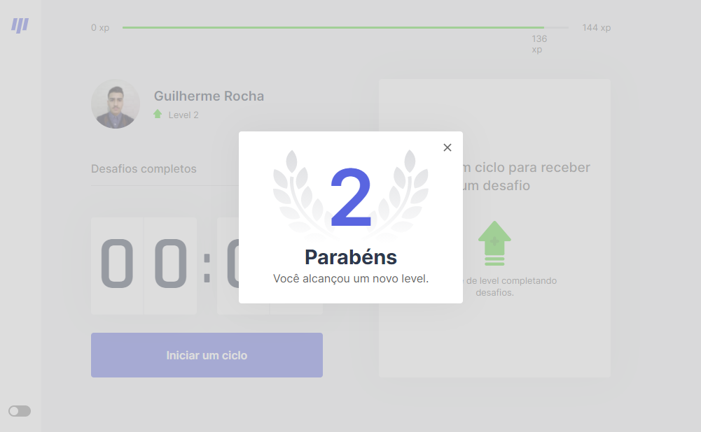
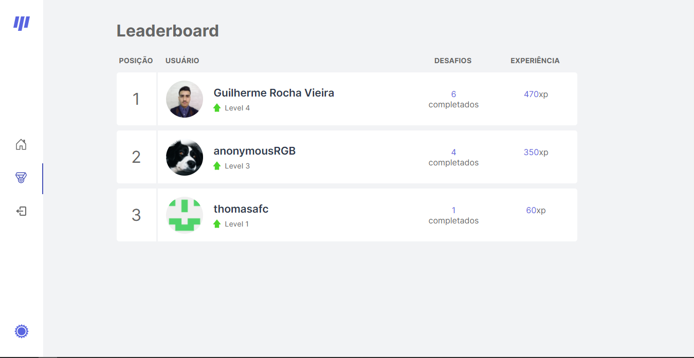

<p align="center">
  

  
  
  <a href="https://github.com/grochavieira/moveit/commits/master">
    
  </a>
    
   

  <a href="https://github.com/grochavieira">
    
  </a>
  
 
</p>
<h1 align="center">
    
</h1>

<h4 align="center"> 
	🚧  Aplicação finalizada! 🚧
</h4>

## 🏁 Tópicos

<p>
 👉<a href="#-sobre-o-projeto" style="text-decoration: none; "> Sobre</a> <br/>
👉<a href="#-funcionalidades" style="text-decoration: none; "> Funcionalidades</a> <br/>
👉<a href="#-layout" style="text-decoration: none"> Layout</a> <br/>
👉<a href="#-como-executar-o-projeto" style="text-decoration: none"> Como executar</a> <br/>
👉<a href="#-tecnologias" style="text-decoration: none"> Tecnologias</a> <br/>
👉<a href="#-autor" style="text-decoration: none"> Autor</a> <br/>
👉<a href="#user-content--licença" style="text-decoration: none"> Licença</a>

</p>

## 💻 Sobre o projeto

Uma aplicação que simula a utilização da técnica de pomodoro com o intuito de tornar devs mais produtivos e mais saudáveis.

Abaixo disponibilizei um link para o site hospedado:

<a align="center" href="https://moveit-taupe-sigma.vercel.app/">
    
</a>

---

<a name="-funcionalidades"></a>

## ⚙️ Funcionalidades

- [x] Front-end;
  - [x] Pagina Principal;
  - [x] Cronômetro;
  - [x] Barra de Experiência;
  - [x] Desafios;
  - [x] Botão de Falhei - Cancela Desafio e Reseta Cronômetro;
  - [x] Botão de Completei - Adiciona Experiência do Desafio e Reseta Cronômetro;
  - [x] Apresenta um Modal quando usuário sobe de nível;
  - [x] Os dados do usuário são salvos em cookies;
  - [x] Alternância entre tema claro e escuro.

### A milha extra...

- [x] Troca de temas da interface, na qual o tema é salvo dentro de um cookie;
- [x] A troca de temas é feita pela propriedade data-theme da tag html;
- [x] Foi adicionado rotas para uso do MongoDB como banco de dados da aplicação;
- [x] Foi criado uma Side Bar;
  - [x] Navegação entre Página principal e de Rankings;
  - [x] Botão de LogOut;
  - [x] Troca de Temas;
- [x] Página de Login;
  - [x] Layout Completo;
  - [x] Login pelo Github com NextAuth;
  - [x] Usuário é registrado no banco de dados (se não existir);
- [x] Página Principal:
  - [x] Os dados do usuário são atualizados;
- [x] Página de Rankings;
  - [x] Layout Completo;
  - [x] É criado um ranking de quem tem mais experiência;
- [x] A aplicação está responsiva.
- [x] A aplicação está totalmente funcional em produção.

---

## 🎨 Layout

### Página de Login

<div align="center">
    
    
</div>

### Página Principal

<div align="center">
    
    
</div>

### Modal que aparece ao súbir de nível

<div align="center">
    
    
</div>

### Página de Rankings

<div align="center">
    
    
</div>

---

## 🚀 Como executar o projeto

Este projeto contém apenas uma parte:

1. Frontend (pasta web)

### Pré-requisitos

Antes de começar, você vai precisar ter instalado em sua máquina as seguintes ferramentas:
[Git](https://git-scm.com), [Node.js](https://nodejs.org/en/), [Yarn](https://classic.yarnpkg.com/en/docs/install).
Além disto é bom ter um editor para trabalhar com o código como [VSCode](https://code.visualstudio.com/)

### ⚠️ Variáveis de Ambiente

Além das ferramentas anteriores, após clonar o repositório, é necessário adicionar váriaveis de ambiente dentro de um arquivo .env na raíz (root) do projeto, que são:

GITHUB_CLIENT_ID="É pego no Auth do seu github"

GITHUB_CLIENT_SECRET="É pego no Auth do seu github"

NEXTAUTH_URL="URL base do seu site, como http://localhost:3000 ou https://moveit-taupe-sigma.vercel.app/"

AUTH_SECRET="Uma string de texto aleatória que é usada no NextAuth"

JWT_SECRET="Uma string de texto aleatória que é usada no NextAuth"

MONGODB_URI="URL do mongodb para armazenar os dados"

#### 🧭 Rodando a aplicação web (Frontend)

```bash

# Clone este repositório
$ git clone https://github.com/grochavieira/moveit.git

# Acesse a pasta do projeto no seu terminal/cmd
$ cd moveit

# Vá para a pasta da aplicação Front End
$ cd web

# Instale as dependências
$ yarn install

# Execute a aplicação em modo de desenvolvimento
$ yarn dev

# A aplicação será aberta na porta:3000 - acesse http://localhost:3000

```

---

## 🛠 Tecnologias

As seguintes ferramentas foram usadas na construção do projeto:

#### **Website** ([React](https://reactjs.org/) + [TypeScript](https://www.typescriptlang.org/))

- **[Next.js](https://nextjs.org/)**
- **[Context](https://pt-br.reactjs.org/docs/context.html)**
- **[js-cookie](https://github.com/js-cookie/js-cookie)**
- **[css-Modules](https://github.com/css-modules/css-modules)**
- **[MongoDB](https://www.mongodb.com/)**
- **[Next-Auth](https://next-auth.js.org/)**
- **[React Icons](https://react-icons.github.io/react-icons/)**

> Veja o arquivo [package.json](https://github.com/grochavieira/moveit/blob/master/web/package.json)

#### **Utilitários**

- Editor: **[Visual Studio Code](https://code.visualstudio.com/)**
- Fontes: **[Rajdhani](https://fonts.google.com/specimen/Rajdhani)**, **[Inter](https://fonts.google.com/specimen/Inter)**

---

<a name="-autor"></a>

## 🦸‍♂️ **Autor**

<p>
<kbd>
 
 </kbd>
 <br />
 <sub><strong>🌟 Guilherme Rocha Vieira 🌟</strong></sub>
</p>

[](https://www.linkedin.com/in/grochavieira/)
[](mailto:guirocha.hopeisaba@gmail.com)

---

## 📝 Licença

Este projeto esta sobe a licença [MIT](./LICENSE).

Feito com :satisfied: por Guilherme Rocha Vieira 👋🏽 [Entre em contato!](https://www.linkedin.com/in/grochavieira/)

---
